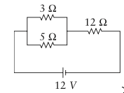

#### in-lecture problem 13

+ New idea:
    + None, more practice with resistors, current, voltage

**There are not problems on both sides. Only this side. The other side should be blank (unless you wrote on it).**

# Problem

1. Find the current through each resistor in the circuit below.

