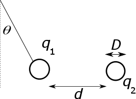

#### in-lecture problem 2

# Instructions

1. Break into groups of **THREE**.
3. Work **with** your group.
4. The questions today are qualitative (no numbers, just words).

New equation: Coulomb's Law:

$$
|\vec{F}| = k\frac{|q_1| |q_2|}{r^2}$, $k=8.99\times 10^9$Nm$^2$/C$^2.
$$

# Problem

A mass with charge $q_1=3.7$nC hangs from a thin thread. It is near a second charge whose charge is unknown. If the diameter of each ball is $D=0.9$cm, the distance $d=5$cm, the angle $\theta=30^\circ$ and the mass of the ball is 0.5 grams, what are the sign and magnitude of the charge $q_2$?

\
