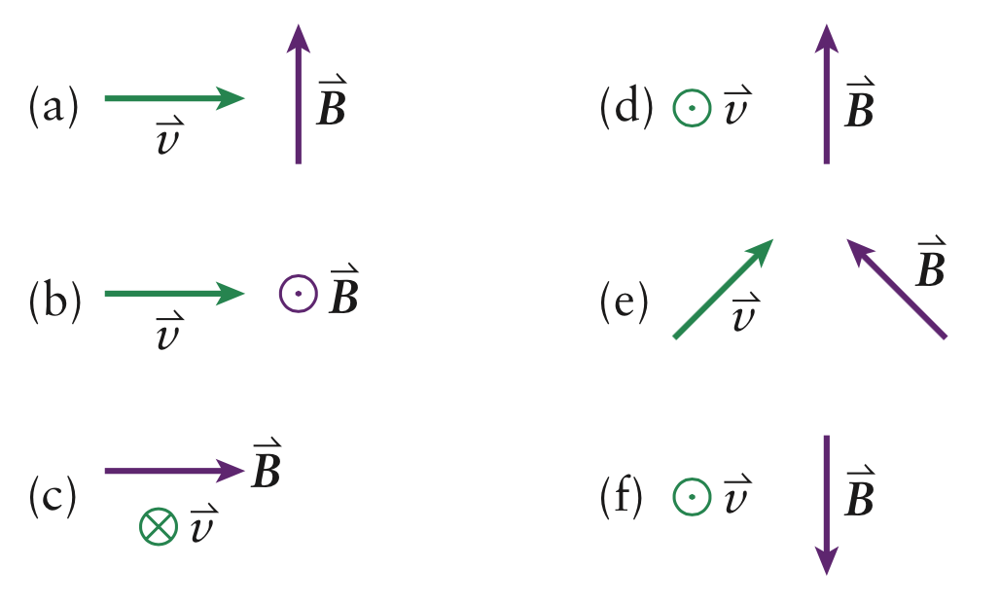

#### in-lecture problem 14

+ New idea:
    + A magnetic field exerts a force on a moving charge.
    + The direction of the force is perpendicular to both the field and the direction of motion.
+ New equations:
    * $|F|=|q|vB\sin\theta$

**Turn this over if you don't have enough problems in your life.**

# Problem

1. Determine the directions of the magnetic forces that act on positive charges moving in the magnetic fields as shown in

\eject

2. An electron is moving with a speed of 18 m/s in a direction parallel to a uniform magnetic field of 2.0 T. What are the magnitude and direction of the magnetic force on the electron?
