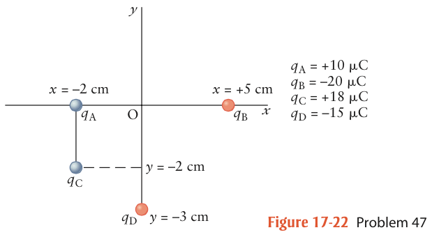

#### in-lecture problem 4

+ New idea:
    + A charge makes an electric *potential* which in turn creates an electric field. Electric potential is measured in Volts, abbreviated "V".
    + A second charge brought near the one making the electric potential will have electric potential energy and feel a force.
+ New equations:
    + Electrostatic potential a distance $d$ from a point charge $q$ (note no absolute values):
$$
V = k\frac{q}{d}.
$$
    + Electrostatic potential energy of the pair of charges when a second charge, $q_2$ is brought near $q$:
$$
U = q_2 V.
$$

# Problem

[FRKT 17.47] Calculate the electric potential at the origin O due to the point charges in the figure below.

