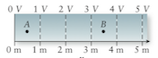
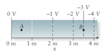

#### in-lecture problem 5

+ New idea:
    + Electric field can be calculated from electric potential.
    + Electrostatic potential energy can be calculated from charge and potential.
+ New equations:
    + $|\vec{E}| = |\Delta V/\Delta x|$, direction is from higher to lower potential.

# Problem

[FRKT 17.49] Calculate the electric field at each of the four points in the two pictures below.

At which point do you think the estimate of the field is the *least* accurate? Why?
